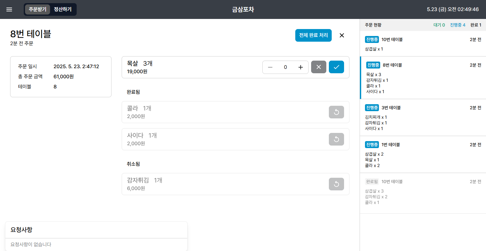
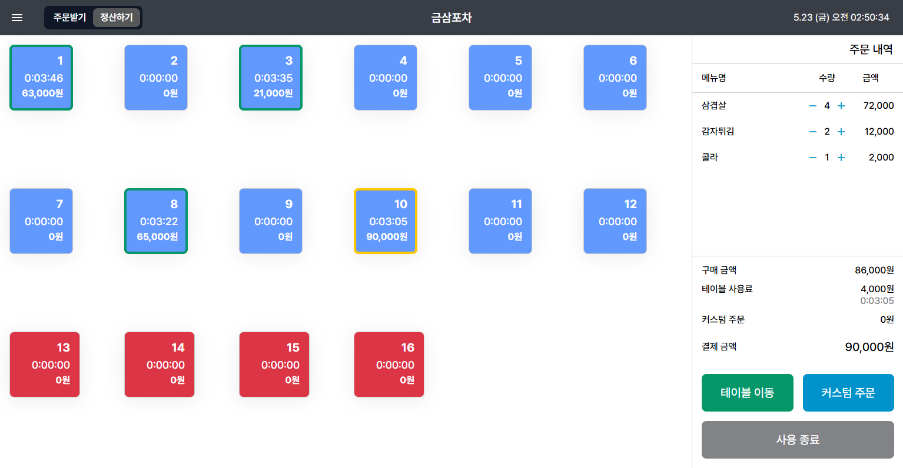
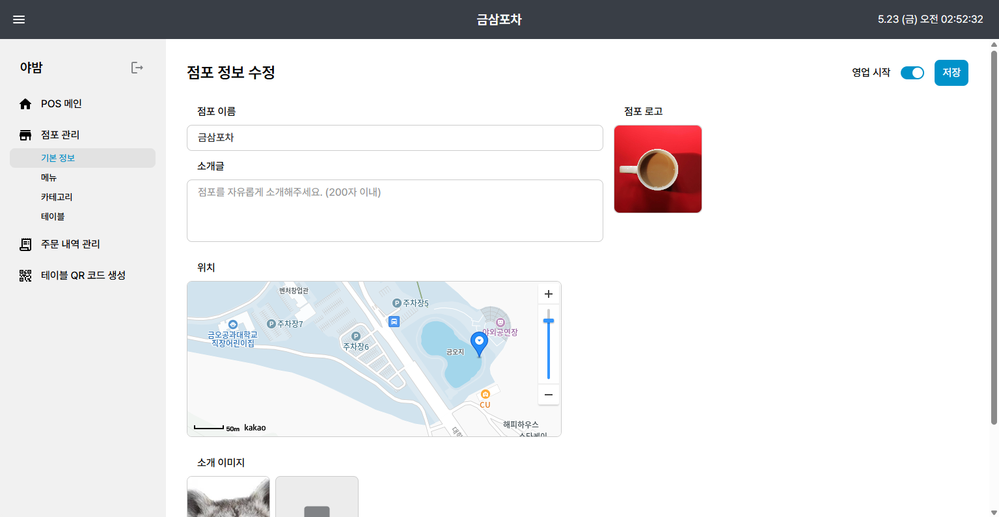
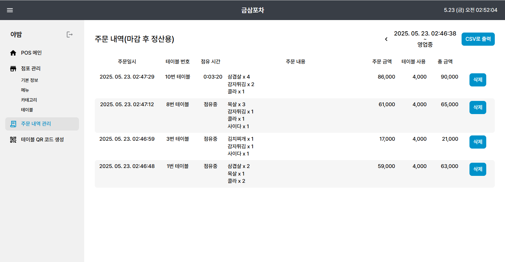

# YABAM-POS

대학교 축제 주막을 위한 테이블 오더 및 POS 시스템 중 점주용 POS 프론트엔드 저장소입니다.

 

## 기술 스택

## 개발 기간

**2025. 4. 12.** ~ **2025. 5. 21.** (40 Days)

## 참여 인원

<h3 align="center">YABAM Project</h3>

||||
|-|-|-|
|<h4 align="center">POS Frontend</h4>|<h4 align="center">Customer Frontend</h4>|<h4 align="center">Backend</h4>|

